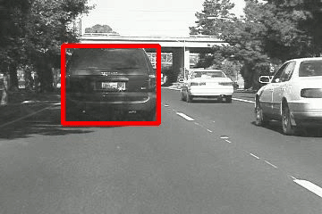

# template-tracker-lucas-kanade

## About
This is the repository for the project - Template Tracker implemented using Lucas Kanade tracking algorithm. In this project, we implement the Lucas Kanade Algorithm to compute the optical flow and track objects (a baby fighting a dragon, Usain Bolt running, and a car) from the given video sequences.

## System and library requirements.
 - Python3
 - Numpy
 - cv2
 - math
 - glob
 
## How to Run
1. Clone this repo or extract the "nalindas_proj_4.zip" file.  
2. Navigate to the folder "Code"  
3. Inside the python scripts - `bolt.py`, `car.py` and `dragonbaby.py`, you need to specify the appropriate dataset path in the `IMAGES_PATH` variable.
4. In the terminal, run the command `python bolt.py` to run the tracker for the Bolt video. Run the command `python car.py` to run the tracker for the car video. Run the command `python dragonbaby.py` to run the tracker for the Dragon Baby video. 

